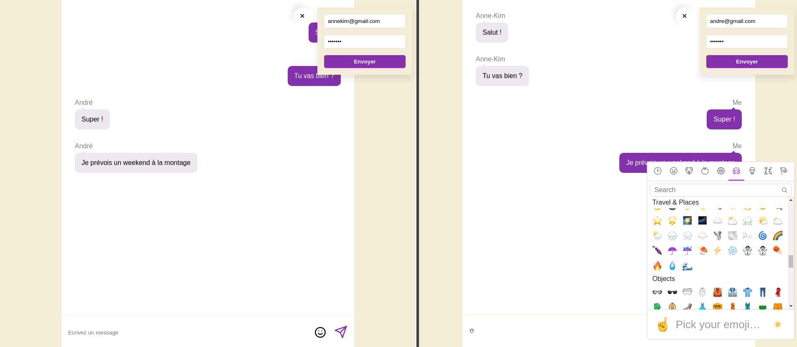

# chatroom-react-redux

## Objectif

Réaliser un chatroom à l'aide de socket io.

## Installation

* installer `yarn`
* lancer `yarn start`
* ouvrir deux onglets http://localhost:8080
* lancement du serveur : https://github.com/AnnekimBanchereau/chatroom-server
* se connecter avec :
  - email : annekim@gmail.com / mot de passe: annekim
  - email : andre@gmail.com / mot de passe : fructis

## Techno

* React
* Redux
* Socket io
* Axios
